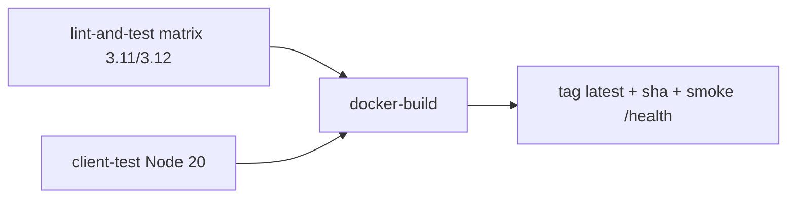

# D3 — CI Pipeline (Lint, Test, Build Image)

**Ticket:** PM4-6558  
**Location:** `PM4-6558-assignment/D3-ci/`  
**Target:** I4 convert service (`I4-convert-pair/service` + client)

---

## 1. Deliverables

| Requirement | Artifact |
|-------------|----------|
| Workflow YAML | `D3-ci/.github/workflows/convert-service-ci.yml` |
| Cache + matrix | pip, npm, GHA docker cache; Python 3.11/3.12 matrix |
| Passing run proof | Local `./scripts/run-ci-local.sh` (see §3) |
| Failure demo | `./scripts/demo-failure.sh` + `artifacts/failure-demo.log` |

---

## 2. Pipeline jobs



| Job | What it does |
|-----|----------------|
| **lint-and-test** | `ruff check app tests` → `pytest -q` |
| **client-test** | `npm test` (7 tests) |
| **docker-build** | Buildx, tags `i4-convert-service:latest` and `:${{ github.sha }}`, curl `/health` |

**Triggers:** push/PR touching `I4-convert-pair/**` or workflow file.

---

## 3. Local passing run (no Docker)

```bash
cd PM4-6558-assignment/D3-ci
./scripts/run-ci-local.sh
```

**Output (verified):**

```
All checks passed!
7 passed in 0.27s
npm test — 7 passed
OK — local CI green
```

---

## 4. Failure mode demo

```bash
./scripts/demo-failure.sh
```

Injects failing test, runs pytest, removes test file.

**Captured failure (`artifacts/failure-demo.log`):**

```
FAILED tests/test_intentional_fail.py::test_intentional_ci_failure_demo
AssertionError: D3 failure demo: deliberate test failure
1 failed, 7 passed
exit code 1
```

On GitHub Actions, the same failure would fail the `lint-and-test` job and block `docker-build` (`needs: [lint-and-test, client-test]`).

---

## 5. Install for GitHub

```bash
./scripts/install-workflow.sh /path/to/repo
git push
```

---

## 6. Supporting files added to I4 service

| File | Purpose |
|------|---------|
| `service/requirements-dev.txt` | pytest + ruff for CI |
| `service/ruff.toml` | Lint rules |

---

## 7. Assignment checklist

| Item | Done |
|------|------|
| Workflow YAML | ✅ |
| Cache / matrix | ✅ |
| Passing run | ✅ local simulation |
| Failure demo | ✅ scripted + log |

**Note:** Full docker-build job runs on GitHub-hosted runners (Docker available). Local machine skips docker step (I5/D2 pattern).
