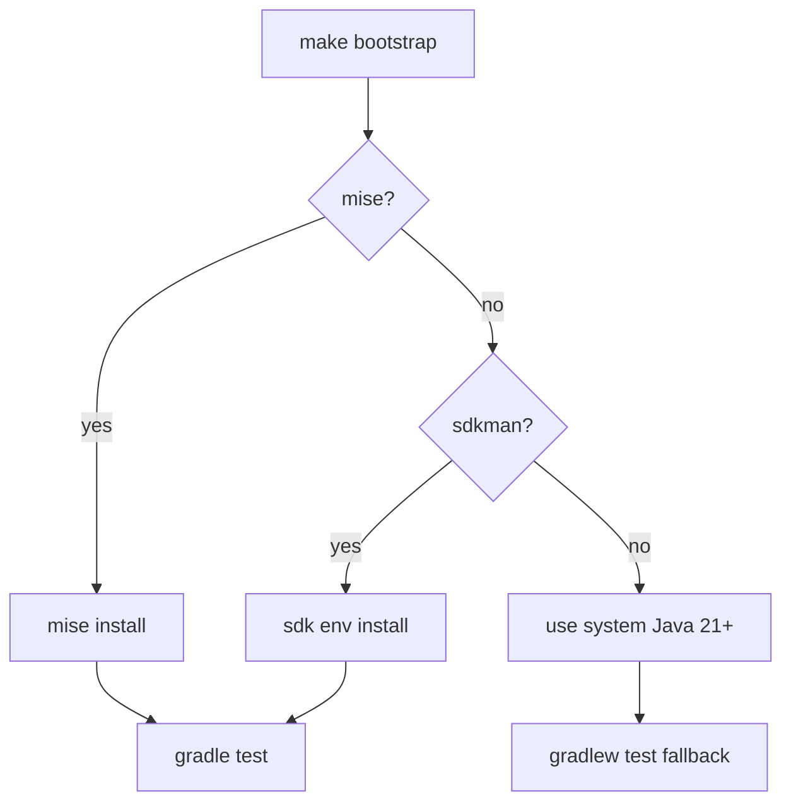

# D5 — Reproducible Dev Environment

**Ticket:** PM4-6558  
**Repo:** `eq-order-hold-consumer`  
**Single command:** `make bootstrap`

---

## 1. Bootstrap config files

| File | Purpose |
|------|---------|
| `Makefile` | `make bootstrap`, `make test`, `make verify` |
| `scripts/bootstrap.sh` | One-command toolchain + test runner |
| `.sdkmanrc` | Java 21.0.2-amzn + Gradle 8.10.2 |
| `.mise.toml` | Alternative: mise Java 21 |
| `.devcontainer/devcontainer.json` | Optional VS Code / Cursor container |
| `docs/bootstrap.md` | Developer runbook |

---

## 2. Single command

```bash
cd eq-order-hold-consumer
make bootstrap
```

---

## 3. Verified output (this machine)

```
==> eq-order-hold-consumer bootstrap (PM4-6558 D5)
==> Using sdkman (.sdkmanrc)
==> Java OK: openjdk version "21.0.2" ...
==> Running unit tests (gradle test)
BUILD SUCCESSFUL in 17s
==> Bootstrap complete — unit tests passed
```

Full log: `D5-bootstrap/artifacts/bootstrap-output.log`

---

## 4. Previously implicit → now explicit

| Implicit before | Explicit now |
|-----------------|--------------|
| Java 21 (Amazon Corretto) | `.sdkmanrc` `java=21.0.2-amzn` |
| Gradle 8.10.2 | `.sdkmanrc` + `gradle/wrapper` 8.10.2 |
| Manual `sdk use java/gradle` | `sdk env install` in bootstrap |
| Which test command | `gradle test` (unit only; ITs need Docker) |
| Gradle daemon / opts | `GRADLE_OPTS` in `.mise.toml` |
| IDE Java support | `.devcontainer/devcontainer.json` |

---

## 5. Toolchain options



---

## 6. Assignment checklist

| Item | Done |
|------|------|
| Bootstrap config files | ✅ |
| Single command + output | ✅ `make bootstrap` |
| Passing test run | ✅ BUILD SUCCESSFUL |
| Implicit deps documented | ✅ §4 |

**Note:** Integration tests (`integrationTest`) require Docker — not part of bootstrap (unit `test` only).
