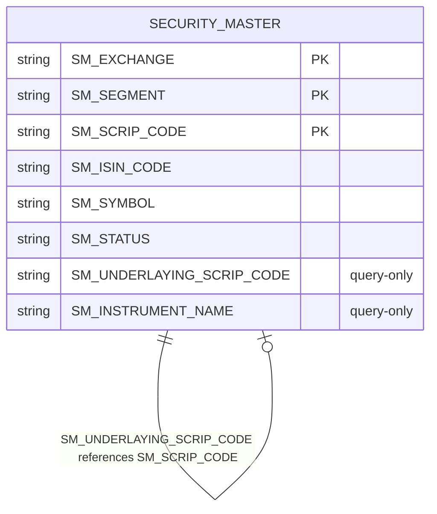

# I1 — ER Diagram: eq-nudge-info-service

> **Note:** This service has **no in-repo Flyway migrations**. OMS schema is DBA-owned. Entities below are JPA mappings only.

## Tables and entities

| Table | Entity | Source file | Primary key |
|-------|--------|-------------|-------------|
| `SECURITY_MASTER` | `SecurityMaster` | `models/oms/SecurityMaster.java` | Composite: `(SM_EXCHANGE, SM_SEGMENT, SM_SCRIP_CODE)` via `SecurityMasterId` |

## Columns mapped in JPA

| Column | Entity field | Type | Notes |
|--------|-------------|------|-------|
| `SM_EXCHANGE` | `id.smExchange` | String(6) | PK part |
| `SM_SEGMENT` | `id.smSegment` | String(1) | PK part |
| `SM_SCRIP_CODE` | `id.smScripCode` | String(30) | PK part |
| `SM_ISIN_CODE` | `smIsinCode` | String(20) | |
| `SM_SYMBOL` | `smSymbol` | String(50) | |
| `SM_STATUS` | `smStatus` | String(1) | Not null |

## Columns referenced in native queries (not mapped as entity fields)

| Column | Used in | Purpose |
|--------|---------|---------|
| `SM_UNDERLAYING_SCRIP_CODE` | `SecurityMasterRepository` | FnO underlying scrip lookup |
| `SM_INSTRUMENT_NAME` | `SecurityMasterRepository` | Instrument type (OPTIDX, FUTIDX) |

## Redis (not relational — cache layer)

| Key pattern | Source | Purpose |
|-------------|--------|---------|
| `nudgescripinfo:{scrip}:{segment}:{exchange}` | `NudgeConstants.NUDGE_SCRIP_INFO_KEY_PREFIX` | ASM/GSM/T2T/RE flags |
| `onedaysettlement:{scrip}:{exchange}` | `NUDGE_T1_INTIMATION_KEY_PREFIX` | T1 intimation date |
| `surveillanceinfoV2:{isin}` | `SURVEILLANCE_INFO_KEY_PREFIX_V2` | Surveillance short codes |
| `surveillanceinfobseV2:{scripId}` | `SURVEILLANCE_INFO_BSE_KEY_PREFIX_V2` | BSE surveillance fallback |
| `drvscripcode:{scripId}` | `DRV_SCRIP_CODE_KEY_PREFIX` | ISIN/instrument cache |

## Relationships

- No explicit FK constraints in JPA
- **Inferred:** `SM_UNDERLAYING_SCRIP_CODE` on a derivatives row points to an equity row's `SM_SCRIP_CODE` (self-referential lookup within `SECURITY_MASTER`)

## Mermaid ER diagram

## Known uncertainty

- Full `SECURITY_MASTER` column set is not mapped — only columns used by this service are documented
- Redis schema is key-value hash maps, not relational tables
