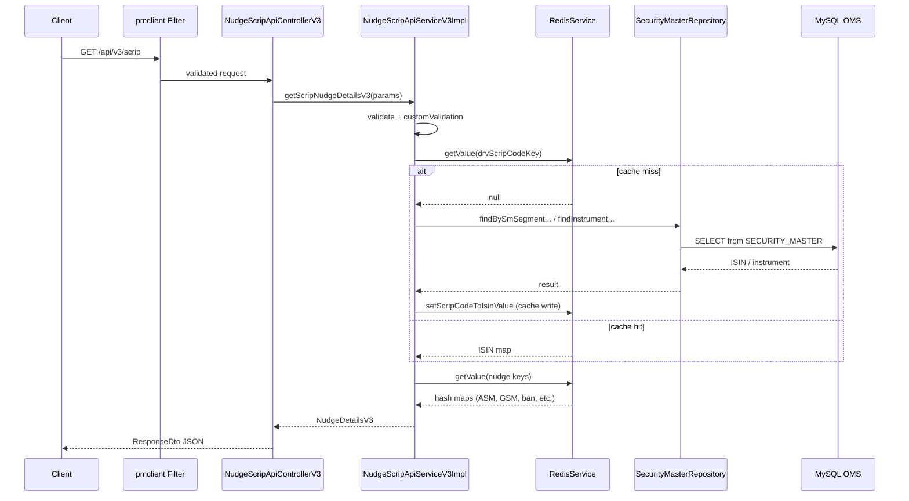

# I2 — End-to-End Flow Trace: GET /api/v3/scrip

## Entry point

`GET /nudge-info/api/v3/scrip?scrip_id=X&segment=D&exchange=NSE`

## Step-by-step path

| Step | File | Function | Action |
|------|------|----------|--------|
| 1 | pmclient filter (external lib) | — | Validates OAuth token |
| 2 | `NudgeScripApiControllerV3.java` | `getNudgeInfoForScrip()` | Parses query params, calls service |
| 3 | `NudgeScripApiServiceV3Impl.java` | `getScripNudgeDetailsV3()` | Main business logic |
| 4 | `NudgeRequestMapper.java` | `mapValue()` | Maps param map → `NudgeScripInfoParamDataV2` |
| 5 | `RequestValidation.java` | `validate()` | Bean validation |
| 6 | `NudgeScripApiServiceV3Impl.java` | `customValidation()` | Segment E requires ISIN; segment D forbids ISIN |
| 7a | `NudgeRedisUtil.java` | `generateDrvScripCodeKey()` | Build Redis key for ISIN lookup |
| 7b | `DefaultRedisServiceImpl.java` | `getValue()` | Check Redis cache for ISIN |
| 8 | `SecurityMasterRepository.java` | native queries | On cache miss: fetch ISIN/instrument from OMS MySQL |
| 9 | `DefaultRedisServiceImpl.java` | `setScripCodeToIsinValue()` | Cache ISIN result in Redis |
| 10 | `NudgeRedisUtil.java` | `generateScripInfoKey()`, `generateSurveillanceInfoKeyV2()` | Build nudge keys |
| 11 | `DefaultRedisServiceImpl.java` | `getValue(List)` | Fetch nudge hash maps from Redis |
| 12 | `NudgeScripApiServiceV3Impl.java` | loop over values | Map Redis fields → `NudgeDetailsV3` booleans |
| 13 | `NudgeScripApiControllerV3.java` | return | Wrap in `ResponseDto(data, Meta.successMeta())` |

## External dependencies

| System | When used |
|--------|-----------|
| Redis | Always (primary data source for nudge flags) |
| MySQL OMS (`SECURITY_MASTER`) | Cache miss for ISIN/instrument lookup |
| pmclient OAuth | Every public API request |

## DB / cache side effects

- **Read-only** on MySQL (SELECT queries only)
- **Write** to Redis on cache miss (`setScripCodeToIsinValue`) — populates ISIN cache

## Sequence diagram

## Known uncertainty

- Exact pmclient filter class names are in external `pmclient` JAR, not in this repo
- Redis hash field schemas are populated by upstream schedulers/consumers (e.g. `eq-nudge-scheduler-service`), not this service
