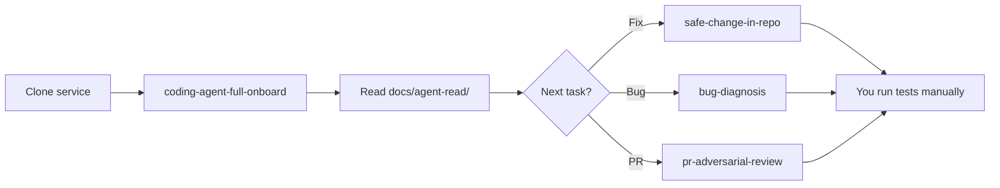
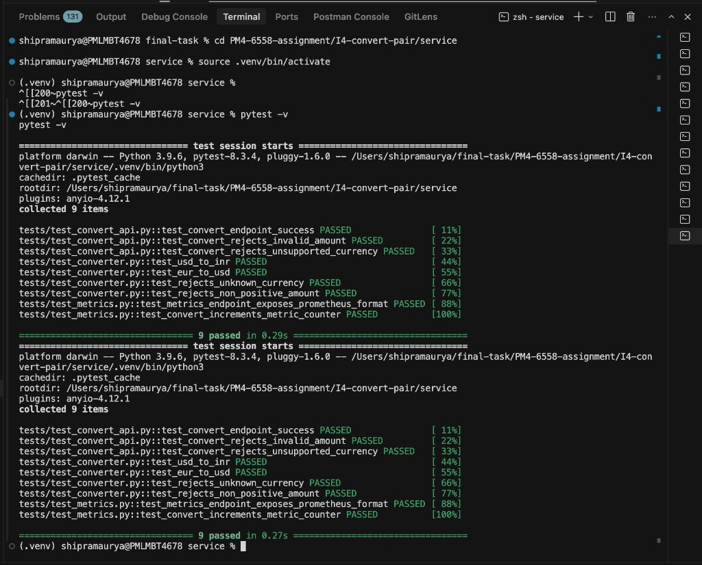
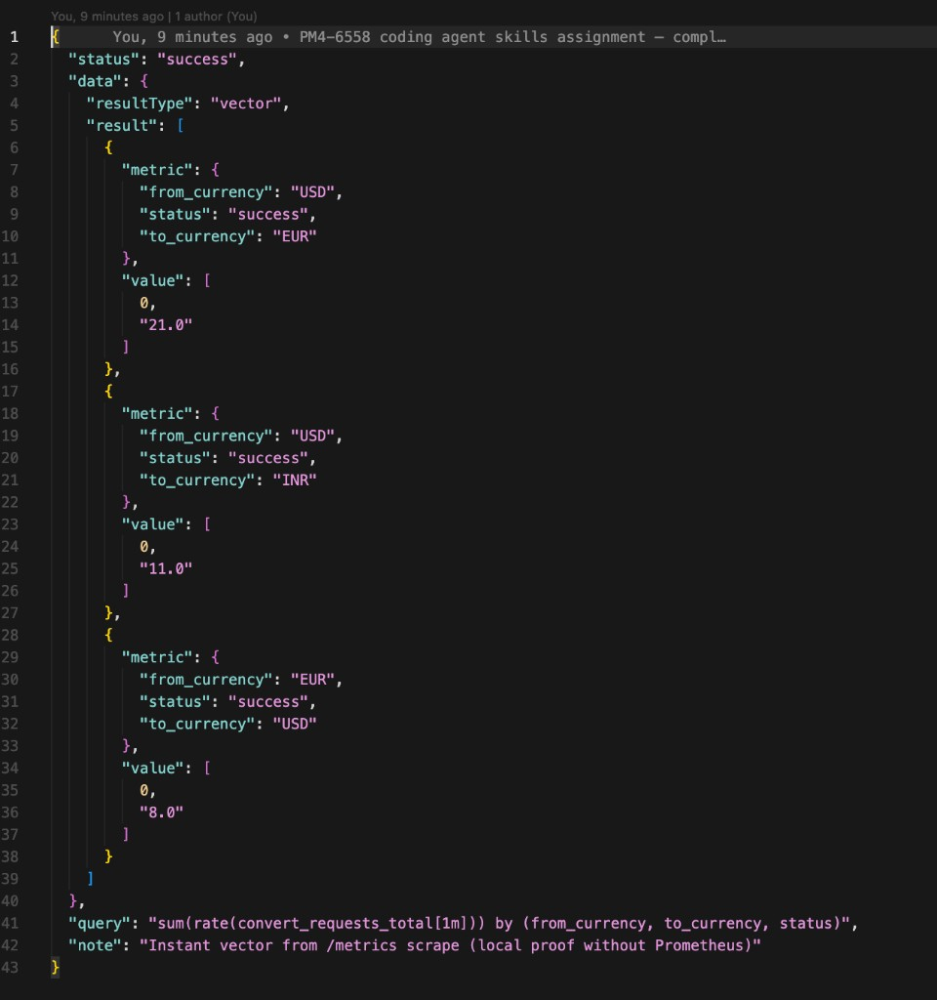
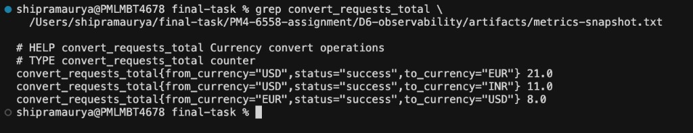
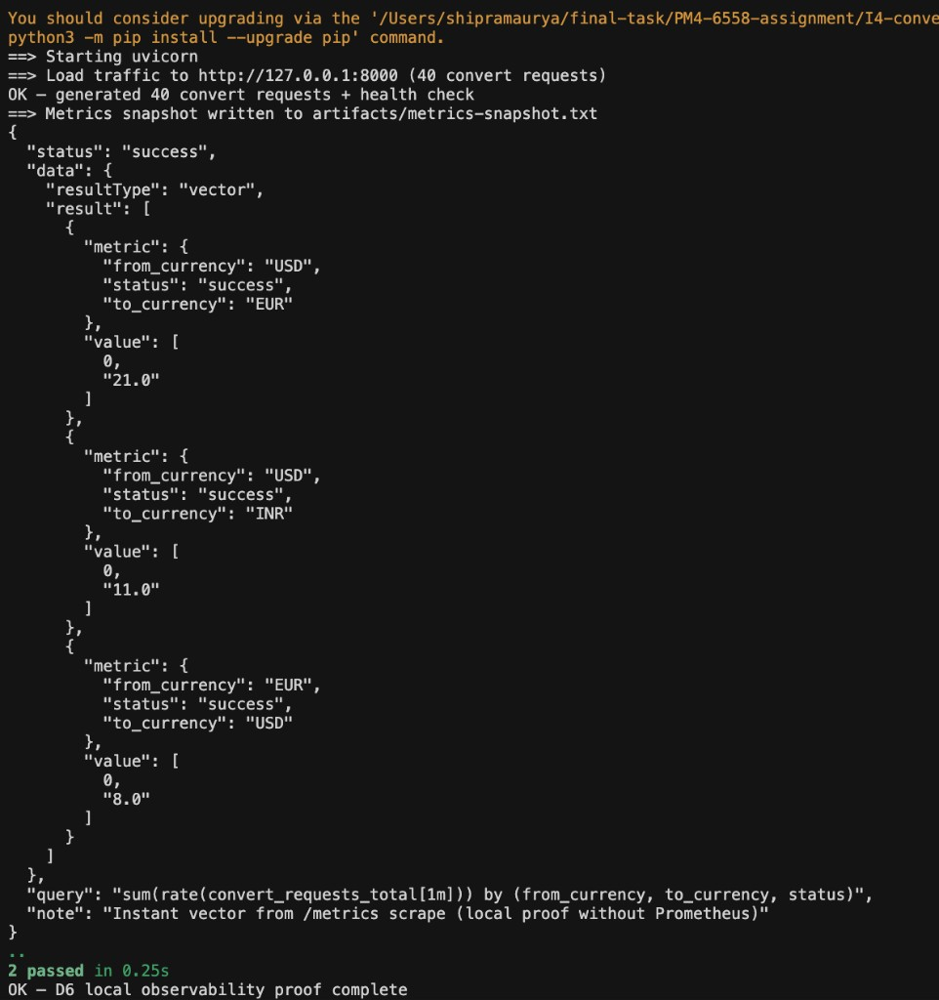
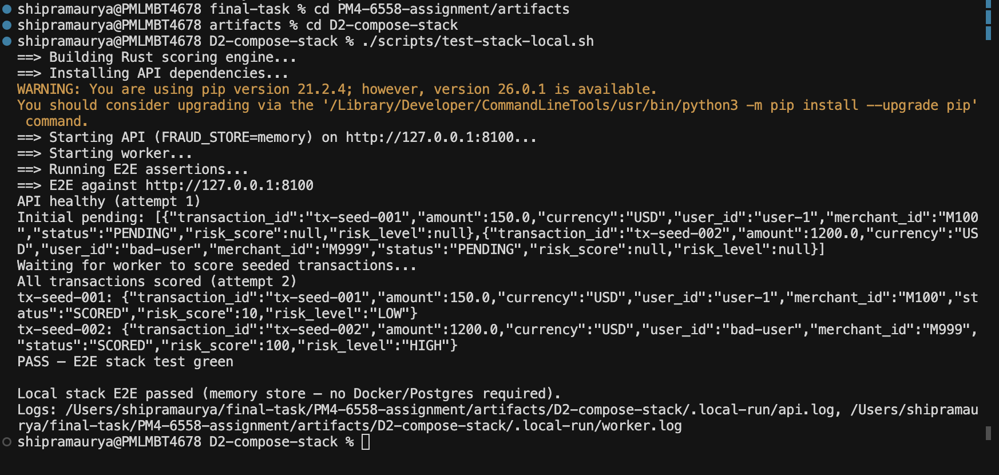

# PM4-6558 — Coding Agent Skills Assignment

**Candidate:** Shipra Maurya (`t-shipra.maurya@pmltp.com`)  
**Jira:** [PM4-6558](https://paytmmoney.atlassian.net/browse/PM4-6558)  
**Parent initiative:** PM4-6057 — AI Learning | Coding agent skills  
**Assignment reference:** [What can you do using a coding agent?](https://docs.google.com/document/d/1Y23tu2ePPexkBhh_G0RCK1fNio_NQ3EZuTbgWa_UyPA/edit)  
**Status:** All exercises complete · Jira submitted for review · Google Doc self-eval filled

---

## Executive summary

This repository is my **submission evidence** for the Paytm Money coding-agent skills assignment. I used Cursor + agent skills to:

1. **Read unfamiliar repos** (inventory, API maps, ER diagrams, flow traces, tests)
2. **Build greenfield services** in Python, Node.js, and Rust
3. **Operate safely in production-adjacent code** (small fixes, PR review, modernization)
4. **Run parallel agent workflows** (worktrees, multi-language systems)
5. **Produce infra/DevOps artifacts** (Terraform, Docker Compose, CI, Kubernetes, observability)
6. **Apply learnings on real FO work** — Testcontainers integration tests for `eq-order-hold-consumer` (PM4-6500)

Every exercise has a **write-up markdown file**, **runnable code** (where applicable), and notes on **what the agent suggested vs what I manually verified**. See [`learnings.md`](learnings.md) for gaps, recommendations, and honest limitations.

**Visual proof:** Four PNG screenshots in [`docs/screenshots/`](docs/screenshots/) document live pytest runs and D6 observability (details below).

---

## How to use this agent

This repo ships a **Cursor agent setup** — rules + skills — so you can run the same workflows on **any service you clone**, not only this assignment folder. You use **Cursor chat** as the agent; skills tell it *what to do* and rules tell it *how to behave*.

### What you need

| Requirement | Notes |
|-------------|--------|
| [Cursor](https://cursor.com) | Agent mode (chat with codebase access) |
| A service repo | e.g. `eq-order-hold-consumer`, `eq-nudge-info-service` — open as workspace or add to workspace |
| Skills installed | Copy from this repo (one-time, below) |

### One-time setup

**1. Install skills globally** (works in any project):

```bash
mkdir -p ~/.cursor/skills
cp -R /path/to/PM4-6558-assignment/.cursor/skills/* ~/.cursor/skills/
```

**2. Install rules on a service repo** (optional but recommended):

```bash
cd /path/to/your-service
mkdir -p .cursor/rules
cp /path/to/PM4-6558-assignment/docs/cursor-rules/*.mdc .cursor/rules/
```

| Rule | Effect |
|------|--------|
| `agent-verification.mdc` | Agent must run tests and document agent vs manual proof |
| `java-spring-safe-change.mdc` | Minimal diffs on Java/Spring repos |

**3. Open Cursor** on the service repo → start a **new Agent chat**.

---

### Invoke a skill (in Cursor chat)

Type `@` and pick a skill, or paste a prompt that names the skill. Skills live in [`.cursor/skills/`](.cursor/skills/).

| Goal | Skill to invoke | Example prompt |
|------|-----------------|----------------|
| **Full read pack** (B1–I2 + index) | `coding-agent-full-onboard` | See below |
| Quick read (B1–B3 only) | `coding-agent-read-any-service` | See below |
| Repo inventory only | `repo-inventory` | `/repo-inventory` |
| API routes map | `api-endpoint-map` | `/api-endpoint-map` |
| Find & run tests | `test-discovery` | `/test-discovery` — run tests and paste output |
| ER diagram | `er-diagram-from-repo` | `/er-diagram-from-repo` |
| One flow trace | `flow-trace` | `/flow-trace on GET /api/v1/scrip` |
| Small fix with ticket | `safe-change-in-repo` | `/safe-change-in-repo PM4-XXXX — describe change` |
| Debug failing test | `bug-diagnosis` | `/bug-diagnosis — pytest test_foo is failing` |
| Review a PR | `pr-adversarial-review` | `/pr-adversarial-review PR #14 vs stage` |

---

### Copy-paste prompts

**Onboard a new service (recommended first run):**

```
Use coding-agent-full-onboard.

Repo: /Users/you/your-service-name
Output: docs/agent-read/
I2 entry: <main endpoint or Kafka topic — or ask agent to pick from B2>

Write B1, B2, B3, I1, I2 markdown under docs/agent-read/ and a README index.
Run the test command from B3 yourself — do not claim pass without output.
```

**Quick read (30–45 min, no ER/flow):**

```
Use coding-agent-read-any-service on /Users/you/your-service-name.
Output to docs/agent-read/. Run B1, B2, B3 only.
```

**Small safe change:**

```
Use safe-change-in-repo.

Ticket: PM4-XXXX
Repo: /Users/you/eq-order-hold-consumer
Base branch: stage
Change: <one sentence scope>

Create branch, minimal diff, update test, run targeted tests, write I3-safe-change.md with risk table and agent vs manual table.
```

**Bug fix:**

```
Use bug-diagnosis.

Repo: /Users/you/your-service
Repro: pytest tests/test_foo.py -v   (or paste failure)

Find root cause, minimal fix, verify, write I6-bug-diagnosis.md.
```

**PR review:**

```
Use pr-adversarial-review.

PR: <url or branch name> → stage
Write A5-pr-review.md with severity, blocking issues, verdict.
```

---

### What the agent produces

| Output | Location |
|--------|----------|
| Read pack (B1–I2) | `<service>/docs/agent-read/*.md` |
| Index | `<service>/docs/agent-read/README.md` |
| Change / bug / review docs | Path you specify or repo root |

Each artifact should end with **Agent suggested vs manually verified** — the agent proposes; **you** confirm by running commands.

---

### Recommended workflow



1. **Read first** — never code blind on an unfamiliar repo.
2. **One exercise per prompt** — smaller scope = better output.
3. **Verify yourself** — run test commands; add screenshot or terminal output to the doc.
4. **Use rules** — keeps diffs small and blocks “tests pass” without proof.

---

### Skill map (16 skills)

**Read & operate**

| Skill | Assignment | Works on any service? |
|-------|------------|------------------------|
| `coding-agent-full-onboard` | B1–I2 + index | ✅ |
| `coding-agent-read-any-service` | B1–B3 (+ optional I1/I2) | ✅ |
| `repo-inventory` | B1 | ✅ |
| `api-endpoint-map` | B2 | ✅ |
| `test-discovery` | B3 | ✅ |
| `er-diagram-from-repo` | I1 | ✅ |
| `flow-trace` | I2 | ✅ |
| `safe-change-in-repo` | I3 | ✅ (needs ticket/scope) |
| `bug-diagnosis` | I6 | ✅ |
| `pr-adversarial-review` | A5 | ✅ |

**Advanced — parallel agent operator**

| Skill | Assignment | Works on any repo? |
|-------|------------|-------------------|
| `coding-agent-advanced-pack` | A1–A6 orchestrator | ✅ |
| `parallel-worktree-plan` | A1 | ✅ |
| `parallel-worktrees-execute` | A2 | ✅ |
| `polyglot-mini-system` | A3 | ⚠️ builds new folder |
| `repo-modernization` | A4 | ✅ |
| `performance-profile-fix` | A6 | ✅ |

**Example — Advanced ticket:**

```
/coding-agent-advanced-pack
Ticket: PM4-6500
Repo: /path/to/eq-order-hold-consumer
Goal: integration tests
Start with parallel-worktree-plan, then parallel-worktrees-execute (2 lanes).
```

**Not skill-packaged:** B4–B6 greenfield, I4 pair, D1–D6 infra.

Full skill source: [`.cursor/skills/README.md`](.cursor/skills/README.md)

**Completed examples in this repo:** `evidence/B/B1-repo-inventory.md` … `evidence/A/A6-performance.md`

---

## Verification screenshots

These images are committed to the repo so HR/evaluators can see **manual verification** at a glance. Reproduce any capture using the commands in the table.

| File | What it proves | How it was captured |
|------|----------------|---------------------|
| [`01-pytest-all-green.png`](docs/screenshots/01-pytest-all-green.png) | **I4 + D6 tests pass** — 9/9 pytest (API, converter, metrics) | `cd artifacts/I4-convert-pair/service && pytest -v` |
| [`02-d6-panel-data-json.png`](docs/screenshots/02-d6-panel-data-json.png) | **D6 panel data** — JSON with USD→EUR (21), USD→INR (11), EUR→USD (8) | `artifacts/D6-observability/artifacts/panel-data.json` |
| [`03-d6-prove-local-terminal.png`](docs/screenshots/03-d6-prove-local-terminal.png) | **D6 full pipeline** — load 40 requests, metrics snapshot, 2 pytest passed | `cd artifacts/D6-observability && ./scripts/prove-local.sh` |
| [`04-d6-metrics-grep.png`](docs/screenshots/04-d6-metrics-grep.png) | **Prometheus counters** — raw `convert_requests_total` lines (21+11+8=40) | `grep convert_requests_total artifacts/D6-observability/artifacts/metrics-snapshot.txt` |
| [`05-d2-local-e2e-green.png`](docs/screenshots/05-d2-local-e2e-green.png) | **D2 local E2E** — API + worker + Rust engine, no Docker | `cd artifacts/D2-compose-stack && ./scripts/test-stack-local.sh` |

### 1 — All tests green (I4 convert + D6 metrics)



*Covers `test_convert_api.py`, `test_converter.py`, and `test_metrics.py` — proves `/metrics` endpoint and convert logic.*

### 2 — D6 dashboard panel data (JSON artifact)



*Grafana/Prometheus-style query result for `sum(rate(convert_requests_total[1m]))` — D6 requirement without Docker/Grafana.*

### 3 — D6 prove-local script (end-to-end)



*Single script: start service → generate traffic → scrape `/metrics` → emit panel JSON → verify with pytest.*

### 4 — Raw Prometheus metrics (grep)



*Direct exposition from `/metrics` — counters match the 40-request load script.*

### 5 — D2 compose stack (local E2E, no Docker)



*Memory-backed API + Node worker + Rust fraud-score — proves D2 flow without Docker Desktop.*

> **Tip for evaluators:** Start with screenshots 1, 3, and 5, then open [`evidence/D/D6-observability.md`](evidence/D/D6-observability.md) and [`evidence/D/D2-compose-stack.md`](evidence/D/D2-compose-stack.md) for full write-ups.

---

## How I used Cursor

This assignment measures **using a coding agent as a pair programmer** — not building a custom AI product. My workflow:

| Step | What I did | Example from this repo |
|------|------------|------------------------|
| **1. Prompt with scope** | Gave the agent one exercise at a time with the doc’s “Show:” checklist | “Complete B3 — test discovery on eq-nudge-info-service” |
| **2. Read unfamiliar repos** | Agent explored; I validated paths and counts | B1/B2 on eq-nudge-info-service |
| **3. Build & iterate** | Agent scaffolded B4–B6, I4, A3; I ran tests and fixed env issues | pytest / npm / cargo locally |
| **4. Parallel lanes** | Split PM4-6500 IT work into worktrees (A1/A2) | Docs lane + JDBC IT lane → merge |
| **5. Adversarial review** | Reviewed agent-generated PR as a human (A5) | PM4-6500 — Approve with follow-ups |
| **6. Verify, don’t trust** | Every exercise doc notes **agent suggested vs manually verified** | See table below + [`learnings.md`](learnings.md) |
| **7. Org skills (optional)** | Used Paytm `be-plan` / MCP Jira for PM4-6500 — **using** existing skills, not authoring new ones | Confluence plan link in README |

**Cursor rules I used** (snippets in [`docs/cursor-rules/`](docs/cursor-rules/)):

- `agent-verification.mdc` — always require manual test proof in artifacts
- `java-spring-safe-change.mdc` — minimal diffs on Spring Boot FO repos (I3, A4, D5)

**Basics self-eval (yes/no + evidence):** [`00-basics-self-eval.md`](00-basics-self-eval.md)

---

## Agent suggested vs manually verified

Summary from [`learnings.md`](learnings.md) — full matrix lives there; key rows:

| Claim | Agent | Manual verification |
|-------|-------|---------------------|
| B3 gradle test passes | Agent run | ✅ BUILD SUCCESSFUL |
| B4–B6 / I4 / A3 tests | Agent scaffold | ✅ pytest / npm / cargo |
| A6 batch scoring ~50× | Benchmark script | ✅ 25.9s → 512ms (50 tx) |
| D1 terraform 12 resources | terraform test | ✅ mock plan passed |
| D4 k8s manifests | kubeconform | ✅ 5/5 Valid |
| D5 `make bootstrap` | Makefile + sdkman | ✅ unit tests green |
| D6 metrics after load | prove-local.sh | ✅ panel-data.json + [screenshots](docs/screenshots/) |
| PM4-6500 IT quality | Agent PR | ✅ A5 review — Approve |

Per-exercise detail: I3, I6, A4, A5 markdown files each include an **agent vs manual** subsection.

---

## How to navigate this repo (for evaluators)

| Start here | Purpose |
|------------|---------|
| **This README** | Overview + **How to use this agent** + screenshots |
| [`00-basics-self-eval.md`](00-basics-self-eval.md) | Yes/no self-eval with evidence links (Garima-style) |
| [`docs/screenshots/`](docs/screenshots/) | PNG proof: pytest green, D6 metrics (4 images) |
| [`docs/cursor-rules/`](docs/cursor-rules/) | 2 Cursor rule snippets used during assignment |
| [`.cursor/skills/`](.cursor/skills/) | **16 reusable skills** — read, operate, **Advanced A1–A6** |
| [`learnings.md`](learnings.md) | Gaps, full verification matrix, checklist |
| [`evidence/README.md`](evidence/README.md) | **Evidence index** — write-ups by exercise + target repo |
| [`artifacts/README.md`](artifacts/README.md) | Runnable code / infra folders |

**Suggested review order (15 min skim → 45 min deep):**

1. Read [`evidence/README.md`](evidence/README.md) or **How to use this agent**
2. Read [`00-basics-self-eval.md`](00-basics-self-eval.md) + **Verification screenshots**
3. Skim **How I used Cursor** and agent vs manual table
4. Read `learnings.md`
5. Skim exercise index below; optionally re-run one verify command

---

## Exercise index (24/24 complete)

### Eval: Basics → covered by exercises below

| Self-eval skill | Exercises |
|-----------------|-----------|
| Repo discovery | B1 |
| Data model | I1 |
| API mapping | B2 |
| Flow tracing | I2 |
| Testing | B3 |
| FastAPI / Node / Rust build | B4, B5, B6 |
| Parallel work | A1, A2 |
| Agent vs manual verification | I3, I6, all `*.md` |

### B — Repo reader & builder

| ID | Topic | Artifact | Quick verify |
|----|-------|----------|--------------|
| B1 | Repo inventory | [`evidence/B/B1-repo-inventory.md`](evidence/B/B1-repo-inventory.md) | Read-only |
| B2 | API endpoint map | [`evidence/B/B2-api-endpoint-map.md`](evidence/B/B2-api-endpoint-map.md) | Read-only |
| B3 | Test discovery | [`evidence/B/B3-test-discovery.md`](evidence/B/B3-test-discovery.md) | `gradle test` in eq-nudge-info-service |
| B4 | FastAPI greenfield | [`artifacts/B4-fastapi/`](artifacts/B4-fastapi/) | `pytest -v` |
| B5 | Node.js greenfield | [`artifacts/B5-nodejs/`](artifacts/B5-nodejs/) | `npm test` |
| B6 | Rust CLI | [`artifacts/B6-rust-logcounter/`](artifacts/B6-rust-logcounter/) | `cargo test` |

### I — Intermediate

| ID | Topic | Artifact | Quick verify |
|----|-------|----------|--------------|
| I1 | ER diagram | [`evidence/I/I1-er-diagram.md`](evidence/I/I1-er-diagram.md) | Mermaid in doc |
| I2 | End-to-end flow | [`evidence/I/I2-end-to-end-flow.md`](evidence/I/I2-end-to-end-flow.md) | Sequence diagram |
| I3 | Small safe change | [`evidence/I/I3-small-safe-change.md`](evidence/I/I3-small-safe-change.md) | Branch in eq-order-hold-consumer* |
| I4 | FastAPI + Node CLI | [`artifacts/I4-convert-pair/`](artifacts/I4-convert-pair/) | `pytest` + `npm test` |
| I5 | Dockerize | [`evidence/I/I5-dockerize.md`](evidence/I/I5-dockerize.md) + [`artifacts/I4-convert-pair/service/Dockerfile`](artifacts/I4-convert-pair/service/Dockerfile) | `docker build` (optional) |
| I6 | Bug diagnosis | [`evidence/I/I6-bug-diagnosis.md`](evidence/I/I6-bug-diagnosis.md) | `pytest` in I4 service |

*I3/A4/D5 code changes live in Bitbucket `eq-order-hold-consumer` — links in exercise docs.

### A — Advanced

| ID | Topic | Artifact | Quick verify |
|----|-------|----------|--------------|
| A1 | Parallel plan | [`evidence/A/A1-parallel-plan.md`](evidence/A/A1-parallel-plan.md) | Read-only |
| A2 | Parallel worktrees | [`evidence/A/A2-parallel-worktrees.md`](evidence/A/A2-parallel-worktrees.md) | Read-only |
| A3 | Fraud-score system | [`artifacts/A3-fraud-score/`](artifacts/A3-fraud-score/) | cargo + pytest + npm |
| A4 | Repo modernization | [`evidence/A/A4-modernization.md`](evidence/A/A4-modernization.md) | `gradle test` after driver change* |
| A5 | Agent PR review | [`evidence/A/A5-pr-review.md`](evidence/A/A5-pr-review.md) | PM4-6500 PR #14 |
| A6 | Performance | [`evidence/A/A6-performance.md`](evidence/A/A6-performance.md) | `node benchmark/bench-scoring.mjs` |

### D — Infra & DevOps

| ID | Topic | Artifact | Quick verify |
|----|-------|----------|--------------|
| D1 | Terraform | [`artifacts/D1-terraform/`](artifacts/D1-terraform/) | `./scripts/tf-verify.sh` |
| D2 | docker-compose stack | [`artifacts/D2-compose-stack/`](artifacts/D2-compose-stack/) | `./scripts/test-stack.sh` (Docker) |
| D3 | CI pipeline | [`artifacts/D3-ci/`](artifacts/D3-ci/) | `./scripts/run-ci-local.sh` |
| D4 | Kubernetes | [`artifacts/D4-kubernetes/`](artifacts/D4-kubernetes/) | `./scripts/validate.sh` |
| D5 | Reproducible bootstrap | [`evidence/D/D5-reproducible-env.md`](evidence/D/D5-reproducible-env.md) | `make bootstrap` in eq-order-hold-consumer* |
| D6 | Observability | [`artifacts/D6-observability/`](artifacts/D6-observability/) | `./scripts/prove-local.sh` |

---

## Real FO delivery (beyond the assignment doc)

| Item | Link / location |
|------|-----------------|
| be-plan PM4-6500 | [Confluence — Implementation plan](https://paytmmoney.atlassian.net/wiki/spaces/PM/pages/748716084) |
| Integration tests PR | Bitbucket PR #14 — **merged** to `stage` on `eq-order-hold-consumer` |
| A5 code review | [`evidence/A/A5-pr-review.md`](evidence/A/A5-pr-review.md) — **Approve** with non-blocking follow-ups |

---

## Environment & honest limitations

| Constraint | How I handled it |
|------------|------------------|
| No Docker on laptop | I5/D2/D4/D6: full artifacts + offline validation; Docker scripts included for evaluators with Docker |
| Gradle wrapper SSL | D5 bootstrap uses sdkman Java 21 + Gradle 8.10.2 |
| Agent claims | Every exercise doc separates **agent suggested** vs **manually verified** |

---

## Quick verification commands (copy-paste)

**One command (all offline-friendly checks):**

```bash
chmod +x scripts/verify-assignment.sh
./scripts/verify-assignment.sh
```

See [`EXECUTION_SUMMARY.md`](EXECUTION_SUMMARY.md) for what runs locally vs CI/cloud proof (Docker gaps documented honestly).

**Individual exercises:**

```bash
# B4 FastAPI (includes GET /health)
cd artifacts/B4-fastapi && python3 -m venv .venv && source .venv/bin/activate
python3 -m pip install -r requirements.txt && python3 -m pytest -v
# optional live check: uvicorn app.main:app --port 8000 & curl -s http://127.0.0.1:8000/health

# B5 Node.js (includes GET /health)
cd artifacts/B5-nodejs && npm test
# optional live check: node src/server.js & curl -s http://127.0.0.1:3000/health

# D2 compose stack (no Docker)
cd artifacts/D2-compose-stack && ./scripts/test-stack-local.sh

# I4 convert pair
cd artifacts/I4-convert-pair/service && python3 -m pip install -r requirements.txt && python3 -m pytest -q
cd ../client && npm test

# A3 fraud score
cd artifacts/A3-fraud-score/engine && cargo test
cd ../service && python3 -m pytest -q
cd ../worker && npm test

# D1 Terraform
cd artifacts/D1-terraform && ./scripts/tf-verify.sh

# D3 CI (local simulation)
cd artifacts/D3-ci && ./scripts/run-ci-local.sh

# D6 Observability (no Docker — python3 -m pip / python3 -m uvicorn)
cd artifacts/D6-observability && ./scripts/prove-local.sh
```

---

## Repo structure

```
PM4-6558-assignment/
├── README.md
├── EXECUTION_SUMMARY.md      ← local vs CI run matrix
├── 00-basics-self-eval.md
├── learnings.md
├── scripts/
│   └── verify-assignment.sh  ← one-command offline verification
├── evidence/                 ← proof write-ups (B / I / A / D)
│   ├── README.md             ← index: exercise → repo → file
│   ├── B/   B1–B3.md
│   ├── I/   I1–I6.md
│   ├── A/   A1–A6.md
│   └── D/   D1–D6.md
├── artifacts/                ← runnable code & infra
│   ├── README.md
│   ├── B4-fastapi/, B5-nodejs/, B6-rust-logcounter/
│   ├── I4-convert-pair/, A3-fraud-score/
│   └── D1-terraform/ … D6-observability/
├── docs/                     ← screenshots, cursor-rules
└── .cursor/                  ← skills + rules
```

---

## Contact

**Shipra Maurya** · t-shipra.maurya@pmltp.com  
Jira: PM4-6558 · Submitted for review
