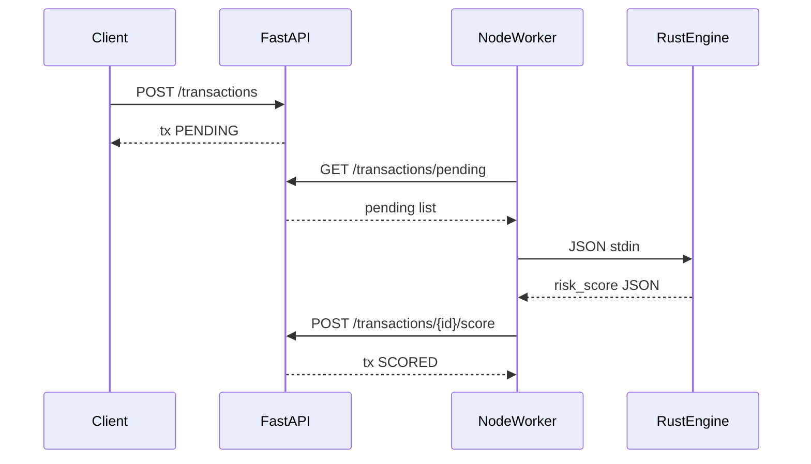

# A3 — Polyglot Mini Fraud-Score System

**Ticket:** PM4-6558  
**Location:** `PM4-6558-assignment/artifacts/A3-fraud-score/`  
**Stack:** FastAPI (Python) · Node.js worker · Rust CLI engine

---

## Deliverables checklist

| Requirement | Artifact |
|-------------|----------|
| FastAPI ingestion | `service/app/main.py` — `POST /transactions` |
| Node worker | `worker/src/worker.js`, `worker/src/run-once.js` |
| Rust scoring CLI | `engine/src/main.rs` + `engine/src/lib.rs` |
| Data contract | `CONTRACT.md` |
| Rust tests | `cargo test` — 3 passed |
| Service tests | `pytest` — 3 passed |
| Node tests / integration | `npm test` — Rust subprocess + mock |
| README run order | `artifacts/A3-fraud-score/README.md` |

---

## Test results (verified)

```bash
cd engine && cargo test          # 3 passed
cd service && pytest -q          # 3 passed
cd worker && npm test            # 2 passed
```

---

## Data flow



---

## Agent suggested vs manually verified

| Item | Agent | Manual |
|------|-------|--------|
| Rust scoring rules | Implemented in lib.rs | ✅ cargo test |
| Worker calls Rust via spawn | worker.js | ✅ npm test builds + invokes binary |
| API pending/score flow | store.py + main.py | ✅ pytest |
| End-to-end 3-terminal | README | ⏳ Run uvicorn + curl + worker |

---

## Assignment ladder

| Exercise | Status |
|----------|--------|
| A3 Polyglot mini-system | ✅ |

**Next:** Google Doc self-eval, or A4/A6 stretch.
