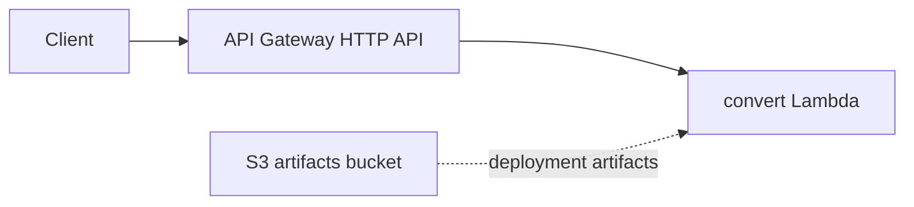

# D1 — Terraform Plan for a Small Service

**Ticket:** PM4-6558  
**Location:** `PM4-6558-assignment/artifacts/D1-terraform/`  
**Service:** Currency convert (mirrors I4) on **S3 + Lambda + API Gateway HTTP API**

---

## 1. Deliverables

| Requirement | Artifact |
|-------------|----------|
| .tf files and variables | `main.tf`, `variables.tf`, `outputs.tf`, `versions.tf` |
| Provider and backend | AWS provider + **local** backend in `versions.tf` |
| Terraform validate | See §2 |
| Terraform plan output | See §3 |
| README apply/destroy | `artifacts/D1-terraform/README.md` |

---

## 2. Terraform validate

```bash
cd PM4-6558-assignment/artifacts/D1-terraform
terraform init -input=false
terraform validate
```

**Output:**

```
Success! The configuration is valid.
```

---

## 3. Terraform plan

### Offline (mock AWS — no Docker / no AWS creds)

```bash
terraform test
```

**Result:** `Success! 1 passed, 0 failed` — mock plan creates **12 resources**, 0 change, 0 destroy.

### Local plan (LocalStack-oriented provider config)

```bash
terraform plan -input=false -out=tfplan
```

**Summary:**

```
Plan: 12 to add, 0 to change, 0 to destroy.

Resources: S3 bucket (+ versioning, public access block), IAM role,
Lambda function, API Gateway v2 (api, integration, 2 routes, stage),
Lambda permission.
```

**Outputs:** `api_gateway_endpoint`, `convert_url`, `health_url`, `s3_bucket_name`, `lambda_function_name`

---

## 4. Architecture



---

## 5. Environment notes

| Constraint | Approach |
|------------|----------|
| No Docker on dev machine | `terraform validate` + `terraform test` (mock) + `terraform plan` |
| No AWS spend | Default `use_localstack=true`, keys `test`/`test` |
| Real apply | LocalStack container or `use_localstack=false` + AWS creds |

---

## 6. Assignment checklist

| Item | Done |
|------|------|
| .tf + variables | ✅ |
| Provider + backend | ✅ |
| validate output | ✅ §2 |
| plan output | ✅ §3 |
| README | ✅ |

**Verify script:** `scripts/tf-verify.sh`
