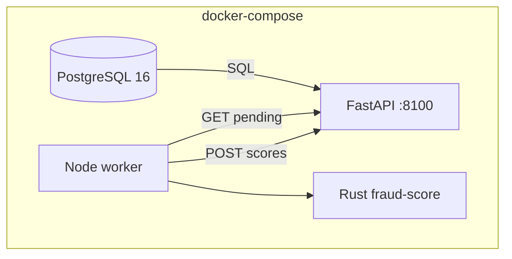

# D2 — docker-compose Stack with End-to-End Tests

**Ticket:** PM4-6558  
**Location:** `PM4-6558-assignment/artifacts/D2-compose-stack/`  
**Stack:** PostgreSQL + FastAPI API + Node worker (Rust engine)

---

## 1. Deliverables

| Requirement | Artifact |
|-------------|----------|
| docker-compose.yml | `docker-compose.yml` — db, api, worker |
| Per-service Dockerfiles | `api/Dockerfile`, `worker/Dockerfile` (multi-stage Rust) |
| Seed / fixture | `db/init/01-schema.sql`, `db/init/02-seed.sql` |
| One-command E2E | `scripts/test-stack.sh` |
| Interaction logs | `test-stack.sh` tails `docker compose logs` |
| Teardown + re-up | `scripts/stack-down.sh` + `test-stack.sh` |

---

## 2. Stack design



**Seed:** 2 pending transactions on first DB boot (`tx-seed-001` LOW risk, `tx-seed-002` HIGH risk).

**Worker loop:** Polls every 2s, batch-scores via Rust CLI, posts scores back to API.

---

## 3. One-command test

```bash
cd PM4-6558-assignment/artifacts/D2-compose-stack
./scripts/test-stack.sh
```

**Expected flow:**
1. `docker compose down -v`
2. `docker compose up -d --build`
3. E2E: health → pending has seeds → worker scores → pending empty → SCORED + risk levels
4. Print api/worker/db logs

---

## 4. E2E assertions (`scripts/e2e-test.sh`)

| Step | Check |
|------|-------|
| Health | `GET /health` → ok |
| Seed visible | pending contains `tx-seed-001` |
| Worker processes | pending count → 0 within ~90s |
| tx-seed-001 | `status=SCORED`, `risk_level=LOW` |
| tx-seed-002 | `status=SCORED`, `risk_level=HIGH` |

---

## 5. Verification on this machine

| Check | Result |
|-------|--------|
| Docker installed | ❌ Not available |
| `docker-compose.yml` YAML parse | ✅ Valid YAML (Python) |
| All scripts + Dockerfiles present | ✅ |
| **Local E2E (no Docker)** | ✅ `./scripts/test-stack-local.sh` — memory store + uvicorn + worker |
| Full `test-stack.sh` (compose) | ⏭️ Run when Docker Desktop installed |

### Local path without Docker or Postgres

```bash
cd PM4-6558-assignment/artifacts/D2-compose-stack
./scripts/test-stack-local.sh
```

Uses `FRAUD_STORE=memory` (seeded `tx-seed-001` / `tx-seed-002`) — same API routes, Rust engine, and Node worker as the compose stack. Postgres path remains the production-like default when `FRAUD_STORE` is unset.

**When Docker is available:**

```bash
brew install --cask docker   # Docker Desktop
./scripts/test-stack.sh
```

---

## 6. Teardown

```bash
./scripts/stack-down.sh   # docker compose down -v
```

Re-run `./scripts/test-stack.sh` for clean re-up from zero.

---

## 7. Assignment checklist

| Item | Done |
|------|------|
| docker-compose + Dockerfiles | ✅ |
| Seed script | ✅ `db/init/*.sql` |
| One-command E2E script | ✅ `scripts/test-stack.sh` + `scripts/test-stack-local.sh` |
| Logs proving interaction | ✅ scripted in test-stack |
| Teardown + re-up | ✅ stack-down + test-stack |
